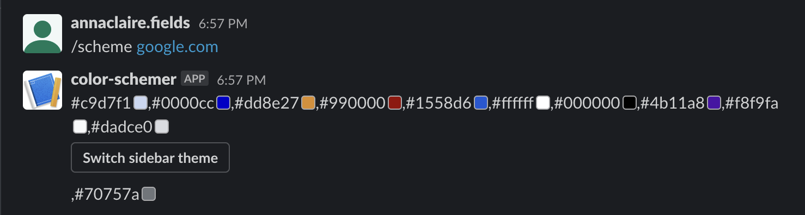

# COLOR SCHEMER

## DEV GUIDE

To develop this locally, you first need to create your own app on slack.

* Start an ngrok http tunnel for port 3000. If you're not sure how to do that, you can follow the tutorial here: https://dashboard.ngrok.com/get-started/setup
* Go to https://api.slack.com/, select "Create new app" and then select "from scratch"
* On the left-hand side bar, select "Oauth and Permissions". Add 'identity.basic' and 'identity.email' to scopes, and set the redirect URL to `${YOUR_NGROK_TUNNEL_ID}/slack/auth/`. Then scroll to the top and click "Install to Workspace"
* After installing the test app to your workspace, you should see your new OAuth Tokens. Create a file at the root of this repository named .env, and add values for SLACK_CLIENT_ID AND SLACK_CLIENT_SECRET
* Finally, select "slash command" from the left-hand menu and create your own command. The redirect URL should be `${YOUR_NGROK_TUNNEL_ID}/`
* In the root of this repository, run `npm install` then `npm run start`
* If you want to compile your typescript code, run `npm run build`

## NEXT STEPS

1. pretier landing page after auth flow
2. accept second argument to specify type of response (e.g. rgb value, svg sample, or name of color)
